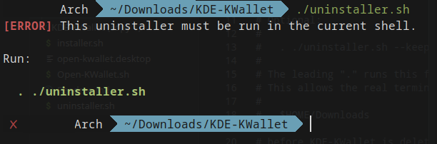

# KDE KWallet

This lightweight workaround on systems where KWallet does not open automatically, this setup automatically checks whether `kdewallet` is open after signing in through SDDM and Plasma desktop starts. If the wallet is closed, it opens it using KDE's D-Bus interface.

>IMPORTANT!
> No passwords are stored in the script.


# How It Works

After a successful SDDM login:

1. KDE Plasma starts.
2. Plasma loads `open-kwallet.desktop` from `$HOME/.config/autostart/`.
3. The autostart entry runs `$HOME/.local/bin/Open-KWallet.sh`.
4. The script waits for the KWallet D-Bus service.
5. It checks whether `kdewallet` is already open.
6. If it is already open, the script exits.
7. If it is closed, the script opens it.


# Requirements

This is intended for KDE Plasma 6.

Required components:
> NOTE
> This install script will check if these packages are installed, if there not it will install them using pacman.

- `bash`,
- `KDE Plasma 6`,
- `plasma-workspace`,
- `KWallet`,
- `kdewallet`,
- `qdbus6`,
- `sddm`

<br>

# Installation


### Using Git

```bash
git clone https://github.com/GamingEvolutionCentre/KDE-KWallet.git
cd $HOME/KDE-KWallet
chmod +x installer.sh
./installer.sh
```

<br>

### Using GitHub CLI

```bash
gh repo clone GamingEvolutionCentre/KDE-KWallet
cd $HOME/KDE-KWallet
chmod +x installer.sh
./installer.sh
```

The installer will:

- Check and install missing dependencies.
- Create `$HOME/.local/bin/` when needed.
- Create `$HOME/.config/autostart/` when needed.
- Install the script as `$HOME/.local/bin/Open-KWallet.sh`.
- Install the Plasma autostart entry as `$HOME/.config/autostart/open-kwallet.desktop`.
- Configure the autostart entry with the correct absolute script path.


## Verify KWallet
after installation reboot, After logging into Plasma run:

```bash
qdbus6 org.kde.kwalletd6 /modules/kwalletd6 org.kde.KWallet.isOpen kdewallet
```

After running the command above the expected result is:
true


# Uninstall

> IMPORTANT!
> DO NOT REMOVE THE DOT IT IS NEEDED FOR THE SCRIPT TO RUN.

<p align="center">
    
</p>
<br>

Automatic (recommended)

```bash
cd $HOME/KDE-KWallet
chmod +x uninstaller.sh
. ./uninstall.sh
. ./uninstall.sh --keep-dependencies
```

Manually

```bash
rm -rf $HOME/KDE-KWallet/ $HOME/.local/bin/Open-KWallet.sh $HOME/.config/autostart/open-kwallet.desktop
```

(Optional) DON'T DELETE IF YOU HAVE OTHER THINGS IN THERE!!
```bash
rm -rf $HOME/.config/autostart/
```

# Security

This project:

- Does not store, request, or process your SDDM password.
- Does not include credentials.
- Runs as your logged-in user inside the Plasma session.
- Communicates with KWallet through KDE's D-Bus interface.

# Support

- If this helped you too maybe think about giving it a star.
